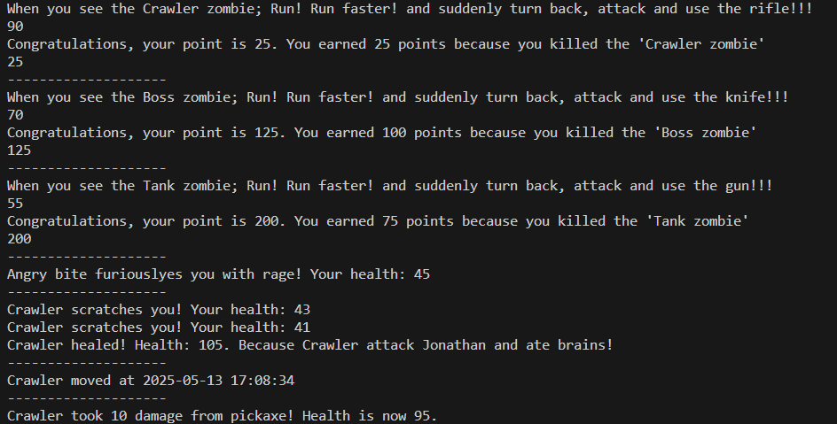

# Zombie Survival Simulator 🧟♂️⚔️
[](https://opensource.org/licenses/MIT)



## Features
- 5 zombie types with unique abilities 🧟♂️
- Score system & weapon randomization ⚔️
- Performance logging (`@timer` decorator) ⏱️
- Real-time score tracking via API 📡

## How to Run
1. Install requirements:
```bash
pip install -r requirements.txt
